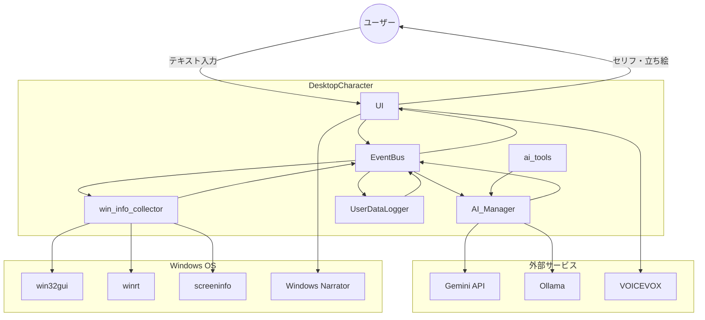
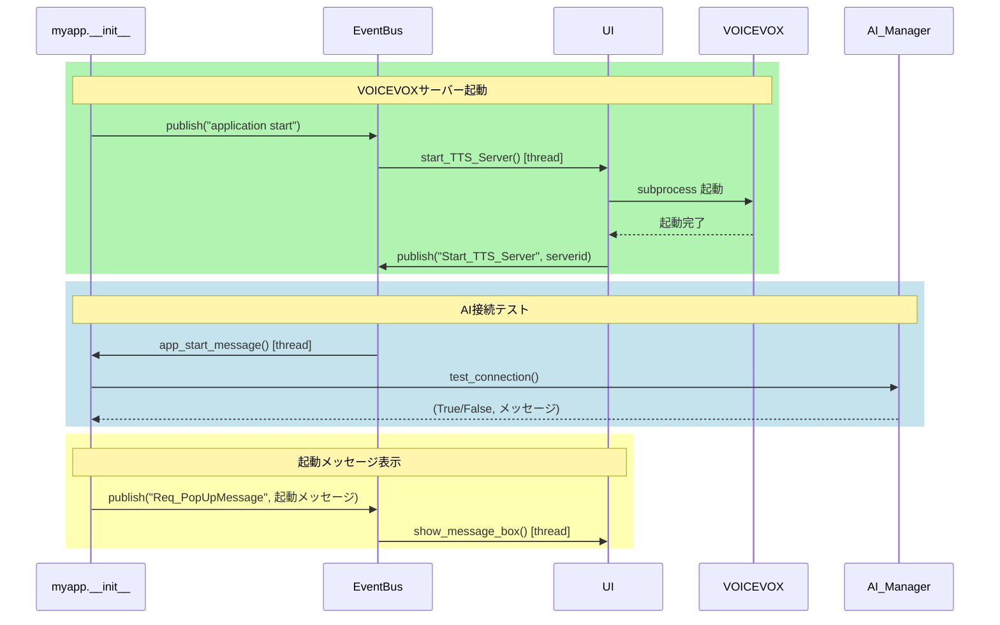
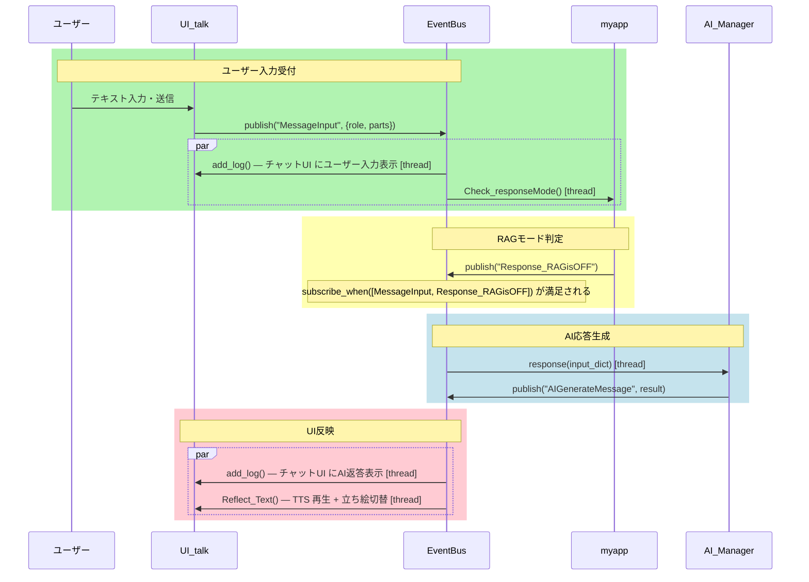
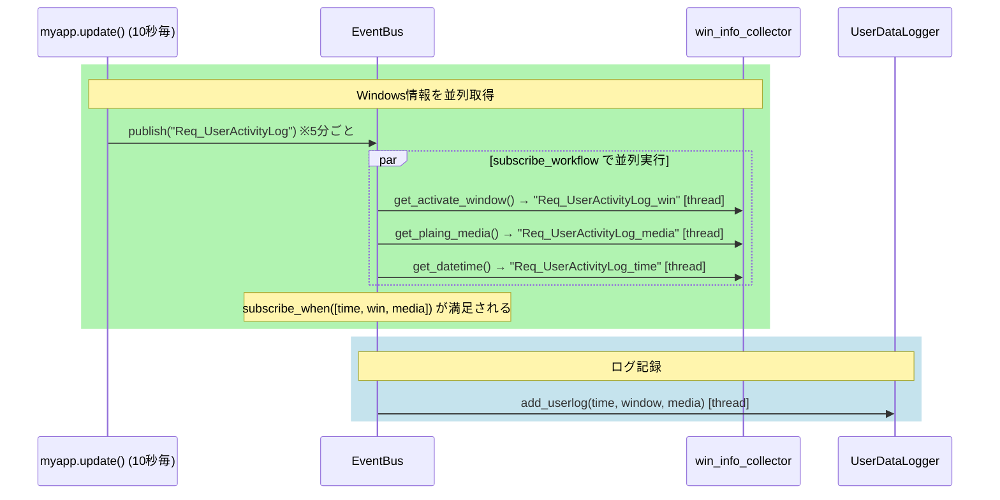

# アーキテクチャ

## 1. システム全体構成

DesktopCharacter は Python/tkinter 製の Windows 専用アプリです。外部サービスとして Gemini API（クラウドLLM）または Ollama（ローカルLLM）、VOICEVOX（音声合成サーバー）を利用し、Windows OS の API からユーザーの作業状況を取得します。



---

## 2. ディレクトリ構造

```
DesktopCharacter/
├── main.py                  # エントリポイント。myapp クラス（AppContext）
├── config.json              # ユーザー設定（config_controller が読み込む）
├── Character_setting.txt    # AIへのキャラクター設定プロンプト
├── main.spec                # PyInstaller ビルド定義
│
├── services/                # インフラ層
│   ├── Event_Bus.py         # EventBus（pub/sub エンジン）
│   ├── config_controller.py # UserSettings（設定の読み書き）
│   ├── WindowsInfoCollecter.py  # Windows API ラッパー
│   ├── UserDataLogger.py    # アクティビティログの記録・要約
│   ├── release_check.py     # GitHub リリース確認
│   └── speech2text.py       # 音声入力（SpeechRecognition + wake word）
│
├── ai/                      # AI層
│   ├── AI_main.py           # AI_Manager（LLMファサード・ReActループ）
│   ├── AI_geminiAPI.py      # Gemini API バックエンド
│   └── AI_ollama.py         # Ollama バックエンド
│
├── ai_tools/                # ReActツール群（自動検出）
│   ├── tool_base.py         # BaseTool 基底クラス
│   ├── tools_main.py        # ToolExecutor（ツール管理・実行）
│   ├── system_tools.py      # システム情報取得ツール
│   └── get_user_activity_summary_tool.py  # ログ参照ツール
│
├── ui/                      # UI層
│   ├── UI_main.py           # UI クラス（tkinter メインウィンドウ）
│   ├── UI_talk.py           # チャットウィンドウ
│   ├── UI_settings.py       # 設定ウィンドウ
│   ├── UI_characterImage.py # 立ち絵表示ウィジェット
│   ├── TTS_VoiceVoxEngine.py       # VOICEVOX TTS バックエンド
│   └── TTS_WindowsNarratorManager.py  # Windows Narrator TTS バックエンド
│
├── 立ち絵/                  # キャラクター画像（フォルダ名で切り替え）
│   └── <Folder>/            # 設定で指定したフォルダ内の画像を AI が選択
│
├── user_logs/               # ユーザーアクティビティログ（日別 JSON）
│   └── YYYY-MM-DD.json
│
└── 配布時添付ファイル/       # 配布パッケージ同梱ファイル
    ├── readme_説明.html
    ├── Character_setting.txt
    └── 立ち絵/
```

---

## 3. コアアーキテクチャ: myapp + EventBus

モジュール間の直接呼び出しを排除し、**EventBus を介したすべての通信** を基本とします。

### myapp（AppContext）

`main.py` の `myapp` クラスが唯一のアプリケーションコンテキストです。`EventBus`、`UserSettings`、すべてのサービス・マネージャーのインスタンスを保持します。サブシステムは `bus` と `setting` だけを受け取り、`main` には逆参照しません。

```
myapp
 ├── bus: EventBus
 ├── setting: UserSettings
 ├── WinInfo: win_info_collector
 ├── UserDataLoger: UserActivityManager
 ├── AI_Manager: AI_Manager
 ├── ui: UI
 └── S2T: speech2text_manager
```

### EventBus（pub/sub）

3種類の購読スタイルがあります。すべてのリスナーはデーモンスレッドで実行されます（Tk UI をブロックしないための設計）。

| メソッド | 用途 |
|---|---|
| `subscribe(event, fn)` | 通常のファンアウト購読 |
| `subscribe_workflow(trigger, handler, response_event)` | `handler` を実行し、戻り値を `response_event` として自動発行。並列情報収集に使用 |
| `subscribe_when([eventA, eventB, ...], fn)` | 全イベントが揃ったときだけ実行（Join）。複数の非同期結果を合流させる |

> **注意**: リスナーはスレッドで実行されるため、tkinter ウィジェットの操作は必ず `self.ui.after(...)` 経由でメインスレッドにマーシャリングすること。

`main.py` の `_setup_event_listeners()` がすべてのイベント配線の唯一の定義箇所です。

---

## 4. データフロー

### 4-A: アプリ起動シーケンス



---

### 4-B: ユーザーメッセージの処理（ReAct OFF / RAG OFF の標準フロー）



---

### 4-C: 5分毎のアクティビティログ記録



---

## 5. サブシステムの詳細

### UserSettings（services/config_controller.py）

`config.json` の入れ子 JSON をフラットな `path → SettingItem` マップに展開します。デフォルト値は `get_default_data()` に定義され、`config.json` の内容がその上にマージされます。

- 読み取り: `setting.get_setting_value("ApplicationSettings.Permission.UserActivityLog")`
- 書き込み: `setting.set_setting_value(path, value)` → 型・範囲バリデーションあり
- 生の dict へのアクセスは禁止

### AI_Manager（ai/AI_main.py）

LLMのファサード。Gemini API または Ollama バックエンドを設定に応じて切り替えます。

- `Character_setting.txt` と `立ち絵/<Folder>/` のファイル名一覧からシステムプロンプトを構築
- AI には `<ファイル名>：<セリフ>` 形式で応答させ、UI が立ち絵を切り替える
- ReAct ループ（`react_planing()`）: JSON形式でツール選択 → 実行 → 観察を最大10ステップ繰り返す

### ReActツール（ai_tools/）

`BaseTool` を継承したクラスを `ai_tools/` ディレクトリに置くだけで自動検出されます。`ApplicationSettings.Permission.<tool.name>` が `True` のツールのみ LLM に公開されます。

新しいツールの追加手順:
1. `ai_tools/<my_tool>.py` に `BaseTool` サブクラスを作成（`name`, `description`, `args_schema`, `execute()` を実装）
2. `services/config_controller.py` の `get_default_data()` に `ApplicationSettings.Permission.<name>` を追加
3. 登録不要 — `ToolExecutor._discover_tools()` が自動で発見する

### win_info_collector（services/WindowsInfoCollecter.py）

Windows 専用の情報収集モジュール。

| メソッド | 取得情報 | 使用ライブラリ |
|---|---|---|
| `get_activate_window()` | フォアグラウンドウィンドウのタイトル | `win32gui` |
| `get_plaing_media()` | 再生中のメディアタイトル・アーティスト | `winrt` |
| `get_datetime()` | 現在日時（YYYY-MM-DD HH:MM 形式） | `datetime` |
| `get_TotalMonitorSize()` | 全モニターの合計解像度と座標 | `screeninfo` |

### UI（ui/UI_main.py）

`tk.Tk` を継承した透過フルスクリーン常時最前面ウィンドウ。背景色 `#888888` を `-transparentcolor` で透過させることでキャラクター画像だけが浮かんで見える。

---

## 6. 技術選定の記録

| 技術 | 選定理由 |
|---|---|
| **Python 3.9.13** | `winrt`（Windows アクションセンターからメディア情報を取得するライブラリ）が Python 3.7〜3.9 にしか対応していないため。Python 3.10 以降に移行する場合は winrt 相当の代替実装が必要 |
| **tkinter** | 標準ライブラリかつ `-transparentcolor` オプションで透過ウィンドウが実現できる。追加インストール不要でビルドサイズを抑えられる |
| **EventBus（自前実装）** | モジュール間の直接参照を排除し、テスト・拡張・並列処理の分離を実現するための設計。すべてのリスナーをデーモンスレッドで実行して Tk UI のブロックを防ぐ |
| **PyInstaller** | Windows 向けの単一 exe ビルド。`ai_tools/` の動的スキャンに対応するため `main.spec` で明示的に `datas` と `hiddenimports` を設定している |
