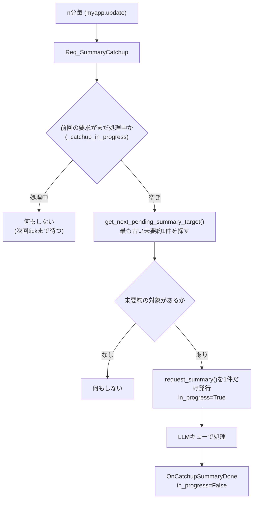

# 要約機能の定刻トリガー廃止・キャッチアップ化 設計方針

## 1. 背景・目的

- `要約日記作成機能.md` に記載の通り、Googleカレンダー連携と同様の日次統合ファイル（日記）を作る前に、
  「PCログおよびその要約機能を正しく調整する必要がある」との整理がある。
- 現状の `UserActivityManager._check_and_trigger_summary()` は `add_userlog()` が呼ばれた瞬間の時刻が
  `分==55`（時間要約）/`23:55`（日次要約）と一致した場合にのみ要約リクエストを発行する。
  アプリが該当分に起動していなければ、その時間帯は**永久に要約されない**。
- 202606の対応でLLMへのリクエストは`AI_Manager` 内の優先度付きキュー経由になっており
  （[LLMキューシステム実装状況] 参照）、複数の要約リクエストを気兼ねなく積めるようになった。
  この基盤を前提に、定刻依存をやめて「未要約分を片付ける」方式に変更する。
- **n分毎に既存のPCログファイルを探索し、時間毎要約と日付毎要約がない場合は古いものから一つずつ順に要求する。**
  **これをn分毎に繰り返すことで対象ファイルを順に減らしていく。**
- **これらの要求は一つのスレッドを使って一つずつ処理し、並行して複数行うことはない。**
- 今回の変更や編集には含まれないが、将来的にはPCログのファイルが完成したタイミングでカレンダーからの
  予定取得と統合要約日記ファイルを作成、PCログファイルを削除する（個人情報保護のため）。

## 2. 変更後の全体フロー

要約は**1tickにつき最大1件だけ**要求する。バッチでまとめて発行するのではなく、
「古いものから1件処理→完了を待つ→次のtickでまた1件」という**トリクル方式**にすることで、
「一つのスレッドで一つずつ処理する」という方針（1章）をシンプルに満たす。



- 「時間要約→日次要約」の順序保証は、`get_next_pending_summary_target()`の探索順
  （日付昇順・同一日内は時間昇順→最後に日次）だけで実現する。新しい優先度制御は追加しない。
- カレンダー取得・統合日記ファイル作成・PCログファイル削除（1章末尾）は**今回のスコープ外**。
  「PCログファイルが完成した」の判定方法も含め、次フェーズで別途設計する。

## 3. 変更対象ファイル

| ファイル | 変更内容 |
|---|---|
| `services/UserDataLogger.py` | 定刻トリガー削除、キャッチアップ関連メソッド追加、既存バグ修正 |
| `main.py` | イベント購読の追加、`Req_SummaryCatchup`のn分毎発行箇所追加（`UserActivityLog`権限でon/off切り替え） |
| `ai/AI_main.py` | `_do_summary()` のバグ修正。「AI未設定」「LLM例外」はポップアップ通知＋キャッチアップ停止に統合、「未知scope」は`response_event`を必ずpublishするプレースホルダー方式のまま修正（キャッチアップが詰まらないようにするため必須） |

## 4. `services/UserDataLogger.py` の変更詳細

### 4.1 削除するもの

- `_check_and_trigger_summary(self, time_str: str)` メソッド全体を削除。
- `add_userlog()` 内の呼び出し箇所（`self._check_and_trigger_summary(time_str)`）を削除。

### 4.2 追加する属性（`__init__`）

```python
self._catchup_in_progress = False
self._catchup_halted = False
self._catchup_lock = threading.Lock()
```
`import threading` をファイル先頭に追加する。

- **`_catchup_in_progress`の役割**: 「要約要求は同時に1件までしか処理中にしない」という
  ガード用フラグ。カウンタではなく単純なbool。`EventBus`のリスナーはスレッドで動くため
  （CLAUDE.md記載の通り）、フラグの読み書きはロックで保護する。
- **`_catchup_halted`の役割**: AIサービスが使えない状態（AI未設定／LLM呼び出し失敗、6.3）に
  なった場合にキャッチアップ機能そのものを停止させるためのフラグ。`_catchup_in_progress`とは
  別物として持つ（「処理中で一時的に待たせる」と「エラーで意図的に止めた」を区別するため）。
  一度`True`になったらアプリ再起動まで`False`に戻らない。

### 4.3 新規メソッド `get_next_pending_summary_target() -> tuple[str, str] | None`

- **引数**: なし
- **戻り値**: 最も古い未要約対象を1件だけ `(scope, target_time)` で返す。無ければ`None`。
  `scope`は`"hour"`または`"day"`、`target_time`は`request_summary()`にそのまま渡せる形式
  （時間: `"YYYY-MM-DD HH:00"` / 日: `"YYYY-MM-DD"`）。
- **役割**:
  1. `user_logs/*.json` を日付昇順で走査（ファイル名から日付を復元。`YYYY-MM-DD`形式以外は無視）。
  2. 各日付ファイル内は時間昇順で `logs` に存在する時間帯をチェックし、
     `check_log_existence(time, "hour")`が`False`の最初の1件が見つかり次第、即座にreturnする。
     **当日かつ現在時刻以降の時間帯は進行中のため対象外**（`is_today and int(hour) >= now.hour`はスキップ）。
  3. その日付内に未要約の時間帯が無ければ、**当日を除く**過去日について
     `check_log_existence(date, "day")`をチェックし、`False`なら日次要約をreturnする。
  4. 該当が無ければ次の日付に進む。全日付を見ても無ければ`None`を返す。
- **範囲**: `user_logs`の全履歴を走査する（直近N日への制限は行わない）。1tickにつき1件しか
  返さないため、走査自体は毎回全履歴に対して行われるが、1件見つかった時点で打ち切るので
  実運用上の負荷は小さい想定。

### 4.4 新規メソッド `run_catchup_tick(debug: int = -1)`

- **引数**: `debug`（プロジェクト共通の`-1`=off規約に従う）
- **役割**:
  1. `self._catchup_lock`を取り、`_catchup_halted`が`True`なら何もせずreturn
     （6.3のエラーにより停止済み。以降アプリ再起動まで何もしない）。
  2. 同じくロックを取った状態で`_catchup_in_progress`が`True`なら何もせずreturn
     （前回発行した要求がまだ完了していない）。
  3. `get_next_pending_summary_target()`で1件取得。`None`なら何もせず終了。
  4. `_catchup_in_progress = True`にしてロックを解放。
  5. `self.request_summary(scope=scope, target_time=target_time, reply_to="OnCatchupSummaryDone")`
     を1件だけ呼び出す（発行のみ。実際のLLM呼び出しはキュー経由で非同期）。
- **呼び出され方**: `"Req_SummaryCatchup"`（main.pyのn分毎tick）からのみ購読される想定（詳細は5章）。
  起動時（`"application start"`）には発火させない方針とした。起動直後の初回tick
  （最大n分後）まで待って処理を始める。

### 4.5 新規メソッド `_on_catchup_done(text: str = "", debug: int = -1)`

- **引数**: `text`（`EventBus.publish(reply_to, text)`から渡される要約本文。中身は使わない）
- **役割**: `"OnCatchupSummaryDone"`イベントの購読ハンドラ。ロックを取って
  `_catchup_in_progress = False`に戻すだけ。次のtickで次の対象が処理される。

### 4.6 既存バグの修正（`request_summary`内、今回のキャッチアップに必須）

`request_summary()`には`reply_to`を握りつぶして`OnCatchupSummaryDone`が発火しなくなる早期return
が**3箇所**ある。トリクル方式は「1件の詰まりが即座に全体を止める」設計のため、この3箇所すべてが
修正必須になる。

**(a) 冒頭の「既に要約済み」チェック**（`request_summary`の一番最初）

```python
# 現状
if self.check_log_existence(target_time, scope)[0] == True:
    return
```

`add_summary_log`自体を呼ばずにreturnするため、`reply_to`が完全に無視される。
`get_next_pending_summary_target()`は未要約のものだけを返す想定だが、スキャン時点と
`request_summary()`呼び出し時点の間にズレが生じるケース（想定外の並行呼び出し、
ファイルI/Oのタイミングなど）を防御的に潰しておく。

→ 既存の要約テキストを`reply_to`にそのまま返して終了するよう修正する:

```python
# 修正後
exists, existing_summary = self.check_log_existence(target_time, scope)
if exists:
    if reply_to != "":
        self.bus.publish(reply_to, existing_summary)
    return
```

**(b)(c) ログ0件時のプレースホルダー保存**（hour/day各1箇所）

現状はどちらも**`reply_to`を呼び出し元の値ではなく固定で`""`にして`add_summary_log`を呼んでいる**:

```python
# 現状（hour）
self.add_summary_log(target_time, scope=scope, reply_to="", text=f"{target_hour}時台のログはありませんでした。")
# 現状（day）
self.add_summary_log(target_time, scope=scope, reply_to="", text=f"{target_time.split(' ')[0]}のログはありませんでした。")
```

このため、もし空ログの日/時間帯がキャッチアップ対象になると（例: アプリを起動した直後に
即終了して空のJSONファイルだけ残った日）、`reply_to="OnCatchupSummaryDone"`が握りつぶされて
`_on_catchup_done`が呼ばれず、**`_catchup_in_progress`が`True`のまま永久に戻らなくなり、
以降すべてのtickが「処理中」判定でスキップされ続ける**。

→ 2箇所とも `reply_to=""` を `reply_to=reply_to`（引数の値をそのまま使う）に修正する。

以上(a)(b)(c)の3箇所を直すことで、`request_summary()`から出るどの経路でも
`reply_to`が必ず一度は呼ばれることを保証する。

### 4.7 新規メソッド `_on_catchup_llm_error(self, scope: str = "", target_time: str = "", debug: int = -1)`

- **引数**: `scope`, `target_time`（`AI_Manager._do_summary()`の`OnSummaryLLMError`から渡される。
  ログ出力にのみ使用）
- **役割**: `"OnSummaryLLMError"`イベントの購読ハンドラ（6.3参照）。ロックを取って
  `_catchup_halted = True`、`_catchup_in_progress = False`にする。
  - `_catchup_halted`を立てることで以降`run_catchup_tick()`は何もしなくなる。
  - `_catchup_in_progress`も一応`False`に戻しておく（`_catchup_halted`が優先されるため
    実害はないが、内部状態を素直に保つため）。
  - ユーザーへの通知（ポップアップ）は`AI_Manager`側で完結しているため、ここでは行わない。

## 5. `main.py` の変更詳細

### 5.1 `_setup_event_listeners()` への追加

```python
    #要約のキャッチアップ（定刻トリガーの代替、1tick=1件のトリクル方式）
self.bus.subscribe("Req_SummaryCatchup", self.UserDataLoger.run_catchup_tick)
self.bus.subscribe("OnCatchupSummaryDone", self.UserDataLoger._on_catchup_done)
self.bus.subscribe("OnSummaryLLMError", self.UserDataLoger._on_catchup_llm_error)
```

- `"Req_SummaryCatchup"`は今回新設。用途は5.2のn分毎トリガーのみ。
- **起動時（`"application start"`）には接続しない**。起動直後は他の初期化処理と重なるため、
  最初のキャッチアップは起動後最大n分以内の最初のtickまで待って開始する方針とした。
- カレンダー取得への接続（`Req_CalendarInfo`の発行）は**今回は行わない**
  （1章末尾の通り次フェーズ）。

### 5.2 `update()` への追加（n分毎トリガー）

既存の5分毎ブロック（`mm_now % 5 == 0`）に相乗りする形で追記:

```python
    #未要約ログのキャッチアップ要求（5分毎、1tickにつき1件）
    if self.setting.get_setting_value("ApplicationSettings.Permission.UserActivityLog") == True:
        self.bus.publish("Req_SummaryCatchup")
```

- 新規タイマーは作らず、既存の5分ハートビートに相乗りする（10秒毎の`ui.after`ループを
  さらに増やさない）。
- トリクル方式は`_catchup_in_progress`フラグで多重発行を防いでいるため、tick間隔を短くしても
  LLMへの同時リクエストは増えない。バッチ方式のときより頻度を上げても安全なため、
  既存の5分間隔（n=5）にそのまま乗せる案としている。**n分の具体的な値は要調整**
  （バックログが多い場合の消化速度とAPIレート制限のバランス次第。9章参照）。
- **権限ガード**: `Req_UserActivityLog`と同じ`ApplicationSettings.Permission.UserActivityLog`
  で判定する。新しい権限フラグは追加しない。この権限項目の説明文
  （`services/config_controller.py:399-402`）はすでに「許可された項目をアプリ内で
  記録・要約・保存して、必要に応じて利用します。」となっており、**要約機能はログ機能の
  一部として元々この権限に含まれている**という位置づけである。ユーザーがこの権限をオフに
  すればログの記録だけでなく要約のキャッチアップも止まる、という理解で統一する。

## 6. `ai/AI_main.py` の変更詳細（バグ修正）

`_do_summary()`には、`response_event`を一切publishせずに`return`してしまう経路が**3箇所**ある。
トリクル方式では「1件の詰まりが即座に全体を止める」ため、いずれも修正必須。
このうち「AI未設定」と「LLM呼び出し失敗」の2つは**同じ「AIサービスが使えない」という状態**
なので、6.3で共通の対応（ポップアップ＋キャッチアップ停止）に統合する。「未知scope」は
性質が異なる（実運用では起きない防御コード）ため、従来通りプレースホルダー保存で対応する。

### 6.1 `AI_client`未設定時（既知のバグ）

```python
def _do_summary(self, payload: dict, response_event: str, debug: int = -1):
    if self.AI_client is None:
        return
    ...
```

`_do_response()`側は同条件でフォールバックメッセージを`publish`しているのに対し、`_do_summary()`だけ
無応答になる非対称なバグ。

**この状態は実運用で頻繁に起こりうる**: `LLMSettings.Service`のデフォルト値は`"未選択"`
（`services/config_controller.py:442`）であり、`AI_client`もデフォルトで`None`
（`ai/AI_main.py:114-115`）。つまり**インストール直後やAIサービス選定前は必ずこの状態**になる。

もし「ログが0件の場合」と同じ発想でここもプレースホルダー保存＋続行にしてしまうと、
AIサービス未設定の期間に溜まったログが片っ端から「AIサービスが選択されていないため
要約できませんでした。」で埋められ、**後からAIサービスを設定しても、その期間のログは
`check_log_existence()`上は「要約済み」扱いになり二度と正しく要約されなくなる**。
これは一時的な設定不備であり、ログ0件（4.6(b)(c)、永久に変わらない事実）とは性質が違うため、
6.3のLLM呼び出し失敗と同じ「止めてユーザーに知らせる」対応に統合する。

### 6.2 未知の`scope`が渡された場合（既存の防御コード、同様の問題）

```python
    else:
        logger.warning(f"_do_summary: 未知のscope '{scope}'")
        return
```

こちらも`logger.warning`のみでpublishせずreturnしており、6.1と同じ症状を起こす。
通常`scope`は`request_summary()`から`"hour"`/`"day"`のいずれかしか渡らないため実運用では
起きにくく、かつ発生しても「一時的な設定不備」ではなく実装上のバグなので、6.1/6.3とは分けて
**プレースホルダー保存＋続行**のまま防御的に塞いでおく。

### 6.3 「AIサービスが使えない」場合の共通対応（未設定・呼び出し失敗、対応必須）

`AI_client.response()`（`ai/AI_geminiAPI.py`の`response()`）は`try/except`を持たず、
Gemini APIのレート制限・ネットワークエラー・safetyブロックなどで普通に例外を送出しうる。
一方`ai/AI_main.py`のLLMキューワーカー（`_worker_loop`）は`task()`の例外を`logger.error`で
ログするだけで、`response_event`を代わりにpublishすることはしない。

6.1（AI未設定）・LLM呼び出し例外のどちらも「AIサービスが今は使えない」という同じ状態であり、
機械的にプレースホルダーで埋め続けると本来要約できたはずの時間帯まで潰してしまう点も共通する。
そのため両方とも次の統一方針で対応する:

1. `Req_PopUpMessage`でユーザーにエラーをポップアップ通知する。
2. `response_event`（＝`OnSummaryDone`）は**publishしない**。
   → `add_summary_log`が呼ばれないため、対象の時間帯/日付にはプレースホルダーが
   保存されず、次回キャッチアップ再開時も引き続き未要約対象として扱われる。
3. 代わりに新設の`OnSummaryLLMError`をpublishし、`UserDataLoger`側で
   キャッチアップ自体を停止させる（4.2・4.4・4.7参照）。
4. 失敗は1回でも即座に停止する（リトライは行わない）。一時的なエラーであっても
   再開にはアプリ再起動が必要、という単純な設計を採用する。

```python
def _do_summary(self, payload: dict, response_event: str, debug: int = -1):
    scope    = payload["scope"]
    time_str = payload["time"]
    reply_to = payload.get("reply_to", "")
    data_str = payload["data"]

    if self.AI_client is None:
        logger.warning("_do_summary: AIサービスが未設定のため要約できません。")
        self.bus.publish("Req_PopUpMessage", "error", "要約機能エラー",
                          "AIサービスが選択されていないため、要約のキャッチアップ処理を"
                          "停止しました。\n設定でAIサービスを選択し、アプリを再起動してください。")
        self.bus.publish("OnSummaryLLMError", scope, time_str)
        return  # response_eventはpublishしない（add_summary_logを呼ばせない）

    if scope == "hour":
        prompt = f"次のユーザの1時間のアクティビティを要約してください。...\n{data_str}"
    elif scope == "day":
        prompt = ("以下はユーザーの1日の活動記録です。...\n" f"{data_str}")
    else:
        logger.warning(f"_do_summary: 未知のscope '{scope}'")
        self.bus.publish(response_event, time_str, scope, reply_to,
                          "内部エラーにより要約できませんでした。")
        return

    try:
        input_contents = [{"role": "user", "parts": [prompt]}]
        response = self.AI_client.response(input_contents=input_contents, debug=debug)
        result_text = response["text"]
    except Exception as e:
        logger.error(f"_do_summary: LLM呼び出しに失敗しました。(scope={scope}, time={time_str}, error={e})")
        self.bus.publish("Req_PopUpMessage", "error", "要約機能エラー",
                          "アクティビティ要約の生成中にエラーが発生したため、"
                          "要約のキャッチアップ処理を停止しました。\n"
                          "設定（AIサービスの接続状況など）を確認し、アプリを再起動してください。\n"
                          f"詳細: {e}")
        self.bus.publish("OnSummaryLLMError", scope, time_str)
        return  # response_eventはpublishしない（add_summary_logを呼ばせない）

    self.bus.publish(response_event, time_str, scope, reply_to, result_text)
```

- **再開条件**: `_catchup_halted`はアプリ再起動でのみ解除される単純な設計とした
  （設定変更やAI再接続を検知して自動再開する仕組みは今回作らない）。ポップアップの文言で
  ユーザーに再起動を促すことで担保する。自動再開が必要になった場合は次フェーズで検討する。
- `_do_response()`（通常のユーザー会話応答）は今回の対象外。キャッチアップの詰まりに直結する
  `_do_summary()`のみを修正する。

## 7. イベント対応表（新規・変更分のみ）

| イベント名 | Publisher | Subscriber | 主な引数 |
|---|---|---|---|
| `Req_SummaryCatchup` | `main.py`（5分毎tick） | `UserDataLoger.run_catchup_tick` | なし |
| `OnCatchupSummaryDone` | `UserDataLoger.add_summary_log`（内部の`reply_to`経由） | `UserDataLoger._on_catchup_done` | `text`（要約本文、未使用） |
| `OnSummaryLLMError` | `AI_Manager._do_summary`（AI未設定／LLM呼び出し例外時、6.3） | `UserDataLoger._on_catchup_llm_error` | `scope`, `time_str` |

既存の `Req_UserSummaryLog` / `OnSummaryDone` の流れ（`request_summary` → `handle_summary_request` →
`AI_Manager.req_LLM` → `_do_summary` → `add_summary_log`）はそのまま利用し、変更しない。

`Req_PopUpMessage`（既存イベント、`main.py`が`ui.show_message_box`を購読済み）に、
`AI_Manager._do_summary`からの新規publish箇所が追加される（6.3参照）。

## 8. 今回のスコープ外（次フェーズ）

1章末尾の通り、以下は今回の変更・編集には含まれない：

- **「PCログファイルが完成した」タイミングの判定**（例: その日の全時間帯＋日次要約が揃った瞬間を
  トリガーにする、など）。
- 判定後の一連処理:
  1. カレンダーから予定を取得（`GoogleCalendarCollector`）
  2. カレンダー予定とPCログ要約を統合したMarkdown日記ファイルを作成
     （`要約日記作成機能.md`本編、`collectors/GoogleCalendarAPI.py`の`generate_daily_md`が参考実装）
  3. 元のPCログJSONファイル（`user_logs/YYYY-MM-DD.json`）を削除（個人情報保護のため）
- `GoogleCalendarCollector.refresh_cache()`のカレンダーDL完了通知イベントの追加
  （上記2の統合ファイル作成が完了通知を必要とするため、そのフェーズで合わせて設計する）。

これらは本ドキュメントの4〜6章の変更が実機で確認できてから着手する。

## 9. 実機検証が必要な項目

- トリクル方式（5分毎に1件）でのバックログ消化速度。1日分のログは最大25件（時間24＋日次1）
  程度になるため、5分間隔なら理論上125分で1日分を消化できる計算だが、実際のLLM応答時間・
  Gemini APIのレート制限を踏まえた検証が必要。数日分放置された場合に許容できる消化時間かも確認する。
- `_catchup_lock`まわりのスレッド安全性（`EventBus`のリスナーがdaemonスレッドで動く実環境での
  タイミング）。
- 4.6のバグ（3箇所のreply_to握りつぶし）修正後、実際に空ログの日・既に要約済みの対象を
  含めてキャッチアップが止まらず進むことの確認。
- 6.3で追加した「AIサービスが使えない」場合の停止動作。以下の2パターンそれぞれで、
  1. ポップアップが表示されること
  2. 対象の時間帯/日付にプレースホルダーが保存され**ない**こと（`get_next_pending_summary_target()`
     が同じ対象を返し続けること）
  3. `_catchup_halted`が立ち、以降のtickで`run_catchup_tick()`が何もしなくなること
  4. アプリを再起動すれば`_catchup_halted`がリセットされ、キャッチアップが再開すること
  を確認する。
  - パターンA: `LLMSettings.Service`を`"未選択"`のままキャッチアップ対象がある状態で起動する
    （6.1）。
  - パターンB: 意図的にAPI呼び出しを失敗させる（ネットワーク遮断、不正なAPIキーなど）か、
    モック等で例外を発生させる（6.3）。
