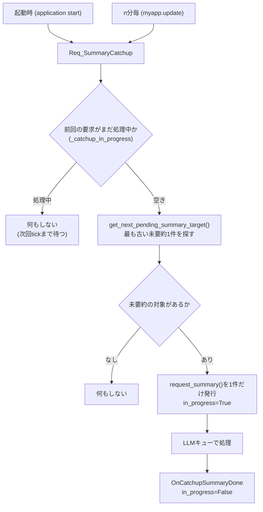

# 要約機能の定刻トリガー廃止・キャッチアップ化 設計方針

## 1. 背景・目的

- `要約日記作成機能.md` に記載の通り、Googleカレンダー連携と同様の日次統合ファイル（日記）を作る前に、
  「PCログおよびその要約機能を正しく調整する必要がある」との整理がある。
- 現状の `UserActivityManager._check_and_trigger_summary()` は `add_userlog()` が呼ばれた瞬間の時刻が
  `分==55`（時間要約）/`23:55`（日次要約）と一致した場合にのみ要約リクエストを発行する。
  アプリが該当分に起動していなければ、その時間帯は**永久に要約されない**。
- 202606の対応でLLMへのリクエストは`AI_Manager` 内の優先度付きキュー経由になっており
  （[LLMキューシステム実装状況] 参照）、複数の要約リクエストを気兼ねなく積めるようになった。
  この基盤を前提に、定刻依存をやめて「未要約分を片付ける」方式に変更する。
- **n分毎に既存のPCログファイルを探索し、時間毎要約と日付毎要約がない場合は古いものから一つずつ順に要求する。**
  **これをn分毎に繰り返すことで対象ファイルを順に減らしていく。**
- **これらの要求は一つのスレッドを使って一つずつ処理し、並行して複数行うことはない。**
- 今回の変更や編集には含まれないが、将来的にはPCログのファイルが完成したタイミングでカレンダーからの
  予定取得と統合要約日記ファイルを作成、PCログファイルを削除する（個人情報保護のため）。

## 2. 変更後の全体フロー

要約は**1tickにつき最大1件だけ**要求する。バッチでまとめて発行するのではなく、
「古いものから1件処理→完了を待つ→次のtickでまた1件」という**トリクル方式**にすることで、
「一つのスレッドで一つずつ処理する」という方針（1章）をシンプルに満たす。



- 「時間要約→日次要約」の順序保証は、`get_next_pending_summary_target()`の探索順
  （日付昇順・同一日内は時間昇順→最後に日次）だけで実現する。新しい優先度制御は追加しない。
- カレンダー取得・統合日記ファイル作成・PCログファイル削除（1章末尾）は**今回のスコープ外**。
  「PCログファイルが完成した」の判定方法も含め、次フェーズで別途設計する。

## 3. 変更対象ファイル

| ファイル | 変更内容 |
|---|---|
| `services/UserDataLogger.py` | 定刻トリガー削除、キャッチアップ関連メソッド追加、既存バグ修正 |
| `main.py` | イベント購読の追加、`Req_SummaryCatchup`のn分毎発行箇所追加 |
| `ai/AI_main.py` | `_do_summary()` のバグ修正（キャッチアップが詰まらないようにするため必須） |

## 4. `services/UserDataLogger.py` の変更詳細

### 4.1 削除するもの

- `_check_and_trigger_summary(self, time_str: str)` メソッド全体を削除。
- `add_userlog()` 内の呼び出し箇所（`self._check_and_trigger_summary(time_str)`）を削除。

### 4.2 追加する属性（`__init__`）

```python
self._catchup_in_progress = False
self._catchup_lock = threading.Lock()
```
`import threading` をファイル先頭に追加する。

- **役割**: 「要約要求は同時に1件までしか処理中にしない」というガード用フラグ。
  カウンタではなく単純なbool。`EventBus`のリスナーはスレッドで動くため
  （CLAUDE.md記載の通り）、フラグの読み書きはロックで保護する。

### 4.3 新規メソッド `get_next_pending_summary_target() -> tuple[str, str] | None`

- **引数**: なし
- **戻り値**: 最も古い未要約対象を1件だけ `(scope, target_time)` で返す。無ければ`None`。
  `scope`は`"hour"`または`"day"`、`target_time`は`request_summary()`にそのまま渡せる形式
  （時間: `"YYYY-MM-DD HH:00"` / 日: `"YYYY-MM-DD"`）。
- **役割**:
  1. `user_logs/*.json` を日付昇順で走査（ファイル名から日付を復元。`YYYY-MM-DD`形式以外は無視）。
  2. 各日付ファイル内は時間昇順で `logs` に存在する時間帯をチェックし、
     `check_log_existence(time, "hour")`が`False`の最初の1件が見つかり次第、即座にreturnする。
     **当日かつ現在時刻以降の時間帯は進行中のため対象外**（`is_today and int(hour) >= now.hour`はスキップ）。
  3. その日付内に未要約の時間帯が無ければ、**当日を除く**過去日について
     `check_log_existence(date, "day")`をチェックし、`False`なら日次要約をreturnする。
  4. 該当が無ければ次の日付に進む。全日付を見ても無ければ`None`を返す。
- **範囲**: `user_logs`の全履歴を走査する（直近N日への制限は行わない）。1tickにつき1件しか
  返さないため、走査自体は毎回全履歴に対して行われるが、1件見つかった時点で打ち切るので
  実運用上の負荷は小さい想定。

### 4.4 新規メソッド `run_catchup_tick(debug: int = -1)`

- **引数**: `debug`（プロジェクト共通の`-1`=off規約に従う）
- **役割**:
  1. `self._catchup_lock`を取り、`_catchup_in_progress`が`True`なら何もせずreturn
     （前回発行した要求がまだ完了していない）。
  2. `get_next_pending_summary_target()`で1件取得。`None`なら何もせず終了。
  3. `_catchup_in_progress = True`にしてロックを解放。
  4. `self.request_summary(scope=scope, target_time=target_time, reply_to="OnCatchupSummaryDone")`
     を1件だけ呼び出す（発行のみ。実際のLLM呼び出しはキュー経由で非同期）。
- **呼び出され方**: `"application start"` と `"Req_SummaryCatchup"`（main.pyのn分毎tick）の
  両方から購読される想定（詳細は5章）。

### 4.5 新規メソッド `_on_catchup_done(text: str = "", debug: int = -1)`

- **引数**: `text`（`EventBus.publish(reply_to, text)`から渡される要約本文。中身は使わない）
- **役割**: `"OnCatchupSummaryDone"`イベントの購読ハンドラ。ロックを取って
  `_catchup_in_progress = False`に戻すだけ。次のtickで次の対象が処理される。

### 4.6 既存バグの修正（`request_summary`内、今回のキャッチアップに必須）

`request_summary()`には「対象時間/日にログが1件も無い場合、LLMを呼ばず即座にプレースホルダーの
要約を保存して終了する」早期returnが2箇所ある（hour/day各1箇所）。現状はどちらも
**`reply_to`を呼び出し元の値ではなく固定で`""`にして`add_summary_log`を呼んでいる**:

```python
# 現状（hour）
self.add_summary_log(target_time, scope=scope, reply_to="", text=f"{target_hour}時台のログはありませんでした。")
# 現状（day）
self.add_summary_log(target_time, scope=scope, reply_to="", text=f"{target_time.split(' ')[0]}のログはありませんでした。")
```

このため、もし空ログの日/時間帯がキャッチアップ対象になると（例: アプリを起動した直後に
即終了して空のJSONファイルだけ残った日）、`reply_to="OnCatchupSummaryDone"`が握りつぶされて
`_on_catchup_done`が呼ばれず、**`_catchup_in_progress`が`True`のまま永久に戻らなくなり、
以降すべてのtickが「処理中」判定でスキップされ続ける**。1件処理するだけのトリクル方式では
この1件が全体を止血なく止めてしまうため、バッチ方式のとき以上に修正が必須。

→ 2箇所とも `reply_to=""` を `reply_to=reply_to`（引数の値をそのまま使う）に修正する。

## 5. `main.py` の変更詳細

### 5.1 `_setup_event_listeners()` への追加

```python
    #要約のキャッチアップ（定刻トリガーの代替、1tick=1件のトリクル方式）
self.bus.subscribe("application start", self.UserDataLoger.run_catchup_tick)
self.bus.subscribe("Req_SummaryCatchup", self.UserDataLoger.run_catchup_tick)
self.bus.subscribe("OnCatchupSummaryDone", self.UserDataLoger._on_catchup_done)
```

- `"application start"`は起動時1回のみ発火する既存イベント（`__init__`内で`publish`済み）。
  起動直後に1件目の未要約対象があればすぐ処理を始められる。
- `"Req_SummaryCatchup"`は今回新設。用途は5.2のn分毎トリガー。
- カレンダー取得への接続（`Req_CalendarInfo`の発行）は**今回は行わない**
  （1章末尾の通り次フェーズ）。

### 5.2 `update()` への追加（n分毎トリガー）

既存の5分毎ブロック（`mm_now % 5 == 0`）に相乗りする形で追記:

```python
    #未要約ログのキャッチアップ要求（5分毎、1tickにつき1件）
    self.bus.publish("Req_SummaryCatchup")
```

- 新規タイマーは作らず、既存の5分ハートビートに相乗りする（10秒毎の`ui.after`ループを
  さらに増やさない）。
- トリクル方式は`_catchup_in_progress`フラグで多重発行を防いでいるため、tick間隔を短くしても
  LLMへの同時リクエストは増えない。バッチ方式のときより頻度を上げても安全なため、
  既存の5分間隔（n=5）にそのまま乗せる案としている。**n分の具体的な値は要調整**
  （バックログが多い場合の消化速度とAPIレート制限のバランス次第。9章参照）。

## 6. `ai/AI_main.py` の変更詳細（バグ修正）

`_do_summary()`は`AI_client`が未設定（`None`）の場合、何もpublishせずに`return`している:

```python
def _do_summary(self, payload: dict, response_event: str, debug: int = -1):
    if self.AI_client is None:
        return
    ...
```

`_do_response()`側は同条件でフォールバックメッセージを`publish`しているのに対し、`_do_summary()`だけ
無応答になる非対称なバグ。今回の変更で「`OnSummaryDone`→`add_summary_log`→`reply_to`」の
チェーンに`_catchup_in_progress`の解除が乗るため、**AIサービス未設定のままキャッチアップが走ると
フラグが戻らず、以降すべてのtickが止まる**（4.6と同様、トリクル方式では1件の詰まりが全体を止める）。

→ `_do_response()`と同じパターンでフォールバックを`publish`するよう修正する:

```python
def _do_summary(self, payload: dict, response_event: str, debug: int = -1):
    scope    = payload["scope"]
    time_str = payload["time"]
    reply_to = payload.get("reply_to", "")
    data_str = payload["data"]

    if self.AI_client is None:
        self.bus.publish(response_event, time_str, scope, reply_to,
                          "AIサービスが選択されていないため要約できませんでした。")
        return
    ...(以下、prompt組み立て以降は現状のまま)
```

## 7. イベント対応表（新規・変更分のみ）

| イベント名 | Publisher | Subscriber | 主な引数 |
|---|---|---|---|
| `Req_SummaryCatchup` | `main.py`（5分毎tick） | `UserDataLoger.run_catchup_tick` | なし |
| `OnCatchupSummaryDone` | `UserDataLoger.add_summary_log`（内部の`reply_to`経由） | `UserDataLoger._on_catchup_done` | `text`（要約本文、未使用） |
| `application start`（既存） | `myapp.__init__` | `UserDataLoger.run_catchup_tick`（追加） | なし |

既存の `Req_UserSummaryLog` / `OnSummaryDone` の流れ（`request_summary` → `handle_summary_request` →
`AI_Manager.req_LLM` → `_do_summary` → `add_summary_log`）はそのまま利用し、変更しない。

## 8. 今回のスコープ外（次フェーズ）

1章末尾の通り、以下は今回の変更・編集には含まれない：

- **「PCログファイルが完成した」タイミングの判定**（例: その日の全時間帯＋日次要約が揃った瞬間を
  トリガーにする、など）。
- 判定後の一連処理:
  1. カレンダーから予定を取得（`GoogleCalendarCollector`）
  2. カレンダー予定とPCログ要約を統合したMarkdown日記ファイルを作成
     （`要約日記作成機能.md`本編、`collectors/GoogleCalendarAPI.py`の`generate_daily_md`が参考実装）
  3. 元のPCログJSONファイル（`user_logs/YYYY-MM-DD.json`）を削除（個人情報保護のため）
- `GoogleCalendarCollector.refresh_cache()`のカレンダーDL完了通知イベントの追加
  （上記2の統合ファイル作成が完了通知を必要とするため、そのフェーズで合わせて設計する）。

これらは本ドキュメントの4〜6章の変更が実機で確認できてから着手する。

## 9. 実機検証が必要な項目

- トリクル方式（5分毎に1件）でのバックログ消化速度。1日分のログは最大25件（時間24＋日次1）
  程度になるため、5分間隔なら理論上125分で1日分を消化できる計算だが、実際のLLM応答時間・
  Gemini APIのレート制限を踏まえた検証が必要。数日分放置された場合に許容できる消化時間かも確認する。
- `_catchup_lock`まわりのスレッド安全性（`EventBus`のリスナーがdaemonスレッドで動く実環境での
  タイミング）。
- 4.6のバグ（空ログ日でのreply_to握りつぶし）修正後、実際に空ログの日を含めてキャッチアップが
  止まらず進むことの確認。
