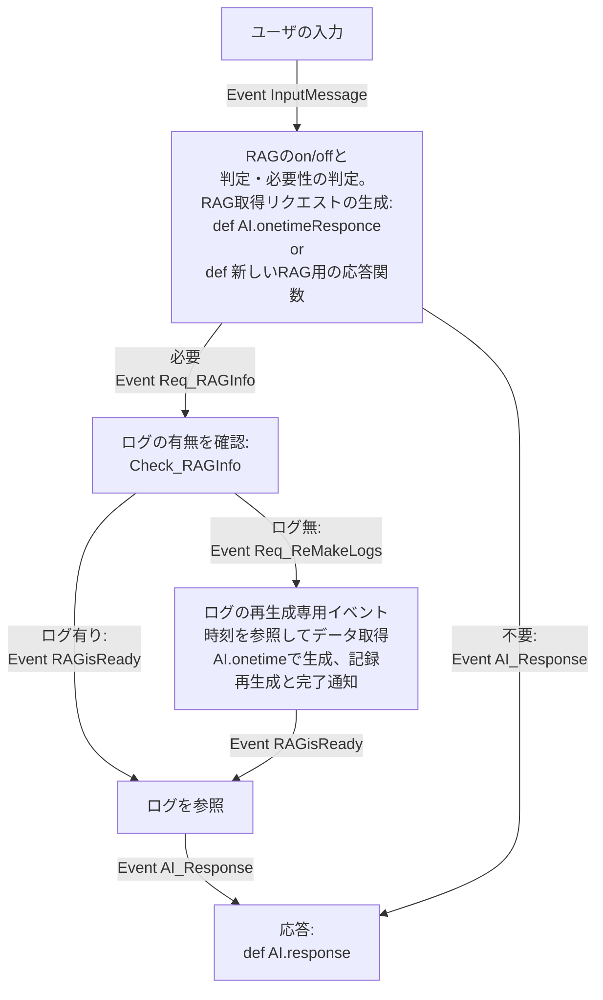

# ユーザーデータ収集機能の開発ログ


## 20260107  
**動作確認やプログラム調整**  
動作確認  
一通りの機能作成完了

**課題と動作確認**  
未->未　RAG情報の渡し方の確認。使ってくれない場合あり  
未->未　RAGで必要情報なしの場合LLMが生成で嘘を言い始める
　　　　_save_data関数で日時指定できるように変更したので動作確認  
未->未　日のログ作成時生成の長さや英語表記への変化が見られた。  
　　　　- 各時間の要約ログを作成してそれをまとめてリクエストが理想  
　　　　- とりあえず時刻毎と5分毎のハイブリッド型を実装予定  


## 20260106  
**動作確認やプログラム調整**  
- 日のログ作成におけるハイブリッド案を実装。  
- LLMサービスにおける会話履歴の扱いにおいてモデルと文章のみを扱うように変更。  
  出力時のみtoken_countをつけてトークン数が分かるようにする。  


**課題と動作確認**  
未->済　ユーザの一日毎の要約ログ（アプリからリクエスト）  
未->未　RAG情報の渡し方の確認。使ってくれない場合あり  
未->未　RAGで必要情報なしの場合LLMが生成で嘘を言い始める  
未->済　ユーザデータの保存先、ファイル名の間違いあり。12/15ファイル名で12/12の内容が保存された。 
　　　　_save_data関数で日時指定できるように変更したので動作確認  
未->未　日のログ作成時生成の長さや英語表記への変化が見られた。  
　　　　- 各時間の要約ログを作成してそれをまとめてリクエストが理想  
　　　　- とりあえず時刻毎と5分毎のハイブリッド型を実装予定  


## 20251219  
**動作確認やプログラム調整**  
日のログ機能の改善案と草案作成  
copyファイルを作成したのでそれをもとに時刻毎ログ＋分ログ合同機能を作成  
> 時刻毎ログを参照しつつ、ない場合は分ログをランダムor一定間隔で取得。  
  どちらもなければ参照データなし。


**課題と動作確認**  
未->未　ユーザの一日毎の要約ログ（アプリからリクエスト）  
未->未　RAG情報の渡し方の確認  
新->未　RAGで必要情報なしの場合LLMが生成で嘘を言い始める  
新->未　ユーザデータの保存先、ファイル名の間違いあり。12/15ファイル名で12/12の内容が保存された。 
　　　　_save_data関数で日時指定できるように変更したので動作確認  
新->未　日のログ作成時生成の長さや英語表記への変化が見られた。  
　　　　- 各時間の要約ログを作成してそれをまとめてリクエストが理想  
　　　　- とりあえず時刻毎と5分毎のハイブリッド型を実装予定  


## 20251215  
**動作確認やプログラム調整**  
- リクエスト処理のエラー解消  
  >handle_rag_requset()でnot in の条件文の前後が逆だったので修正  
- OllamaAIのプログラムにLogger追加  

**課題と動作確認**  
未->未　ユーザの一日毎の要約ログ（アプリからリクエスト）  
未->未　RAG情報の渡し方の確認  
未->済　アクティブウィンドウの取得形式変えたのが反映されてなさげ  
新->未　RAGで必要情報なしの場合LLMが生成で嘘を言い始める  
新->未　ユーザデータの保存先、ファイル名の間違いあり。12/15ファイル名で12/12の内容が保存された。 
　　　　_save_data関数で日時指定できるように変更したので動作確認  
新->未　日のログ作成時生成の長さや英語表記への変化が見られた。
　　　　- 各時間の要約ログを作成してそれをまとめてリクエストで送信する？
　　　　- 時刻ログの中から等間隔にn個取り出して送信


## 20251214
**動作確認やプログラム調整**  
- ログ要求でNoneの際の処理  
  >UserDataLogger.pyのhandle_rag_request()でNoneの時の処理を追加
- RAG機能ONで情報アクセスOFFの際の処理を追加
  >各関数に不許可の際の処理を追加
- n時のログがないときの処理追加
  >ログがない旨をファイルに保存するようにした。(時刻条件に従って保存の場合分け)

**課題と動作確認**  
未->未　ユーザの一日毎の要約ログ（アプリからリクエスト）  
未->未　RAG情報の渡し方の確認  
未->済　アクティブウィンドウの取得形式変えたのが反映されてなさげ


## 20251212
**動作確認と調整**  
- アクティブウィンドウの書式が" - "が2つまである場合がある。  
  その際は書式を "アプリ: サイト[ウィンドウ]" に変更  
  -と–が混ざってたので変更。
- 自発的会話でログが残るのを発見  
  条件の書き分けに苦戦
  #未来のログリクエストではないかつ、今より1日 or 1時間以内ならログは残さない  
  >nessesary_diff = timedelta(hours= 1) if scope == "hour" else timedelta(days= 1)  
  if now > log_time and nessesary_diff > now-log_time:

**課題**  
- RAG機能ONかつアクティブウィンドウや時刻アクセスOFFの場合の処理を考える。
- ログがない場合はログがないことを通知する機能を作る。
  >n時のログはありません。がコンソールに書かれて終わってた。
- RAGInfoがNoneの処理に問題がある。
  >
  2025-12-12 19:53:46,751 - ERROR - [services.UserDataLogger] 時刻フォーマットエラー: None
  2025-12-12 19:53:46,752 - WARNING - [services.UserDataLogger] ログファイルが見つかりません: C:\Users\owner\Documents\myfile\create\programing\DesktopCharacter\user_logs\None.json
  2025-12-12 19:53:46,754 - ERROR - [services.UserDataLogger] 時刻フォーマットエラー: None
  2025-12-12 19:55:12,614 - INFO - [services.UserDataLogger] 要約テキストを保存しました。(time_str, scope, replay_to, error) = (2025-12-12 19, hour, 
  2025-12-12 19:59:47,062 - ERROR - [services.UserDataLogger] 時刻フォーマットエラー: None


## 20251211
### **動作確認しての課題点**  
小さなバグ取りをした。

要約機能の動作確認。今日の内容に関していえば午前の動画視聴が一日の要約だと変わってたりするので渡し方を変える。
>24時間各時間のログ作成をトライして保存してからそれらを使って一日のログを作成する？

アクティブウィンドウの文章形式をソフトウェアとウィンドウ名の関係性などが分かりやすいように変更  
>「ウィンドウ名-ソフトウェア名」から「ソフト名: ウィンドウ名」に変更。  

### **エラー対処**  
データ追加の可能性がある場合にもファイルに保存してた場合があった。  
自発的会話かつログ要求時に発生？ユーザ入力だと大丈夫だった。  
要約ログの保存のタイミングはロガーに残すように変更。  

### **動作確認**  
済　ユーザ入力での応答、自発的会話の応答  
済　ユーザの一時間毎の要約ログ  
済　ユーザの一日毎の要約ログ（定刻）  
未　ユーザの一日毎の要約ログ（アプリからリクエスト）  
未　RAG情報の渡し方の確認  
未　アクティブウィンドウの取得形式変えたのが反映されてなさげ


---
## 20251210
**RAG機能およびログ機能の調整**  
    要約文章生成時に勝手に解釈を入れることがあるので注意。  
    昼前の課題解決の検索、解決したかどうかなどの書き方が悪い。  
    一番時間を使っていたことにのみ言及した方がよさげ？  


**動作確認**  
済　ユーザ入力での応答、自発的会話の応答  
済　ユーザの一時間毎の要約ログ  
済　ユーザの一日毎の要約ログ（定刻）  
未　ユーザの一日毎の要約ログ（アプリからリクエスト）  
未　RAG情報の渡し方の確認  


---
## 20251209
- 20251208を参考にRAGのON/OFFの際の機能実装完了。  
    UserDataLoggerにhandle_rag_request関数を作った。  
    request_usersummary()とadd_summary_log()に引数を追加して必要に応じて完了イベントを発行するように変更。  
- 次は実際に動いているかの確認と、RAG情報を渡す際の渡し方が少し雑なので確認と調整(response_withRAG)  
>handle_rag_request() : RAGのリクエスト文字列を受けて要約ログの有無と再生成のリクエストと完了通知を指示  
response_withRAG() : RAG情報を受けてのテキスト生成用の関数。一応分けておくか？と思ったので。RAG情報の渡し方要改善？


---
## 20251208
20251204を参考にbusでの処理を途中まで作成、再生成の部分で詰めきれてなかった  
UserDataLoger側に新しい関数を作成。Req_RAGInfoを受けてデータの有無によって、RAGisReadyかReq_RemakeRAGで発行する。 
>RAGisReady: 単純にデータがあった時  
 Req_RemakeRAG: データがないのでReq_RAGInfoをもとに add_summary_logを呼び出し、引数で渡す。  

subscribe_workflowでReq_RemakeRAG -> onetime_response() -> RemakeRAG_text  
subscribe_workflowでRemakerRAG_text -> add_summarylog() -> RAGisReady  
subscribeでRAGisReadyからAI.response():responseないで設定参照してRAGがONなら参照する。


---
## 20251204
ログを残す機能が正常に動作しているのを確認した。  
RAG活用での応答の要件定義(20251130からブラッシュアップ)
#### フローチャート



---
## 20251201
したこと：
- UserDataLogerモジュールの整理  
    モジュールの関数を共通化するなどの整理(データ構造はsummaryも配列にした)  

次：  
- ログ残す機能が正常に動作しているかの確認。  
- 過去の生成ができている場合はそちらを参照する機能が動いているかを確認(check_log_existence)  
- 20251130を参考にRAG参照および再生成の仕組み作成  


---
## 20251130
実装しようとしての課題点と方針詰め：  
- UserDataLogerモジュールのプログラムの書き換え  
    hourとdiaryでの関数の共通化、フラグ引数を追加して場合分けで処理。  
- 場合分けでのRAG参照における再生成を試みる仕組み  
    まず生成しようとした場合は生成失敗の文字列が残る。  
    そもそもNoneの場合のみ再生成を行うようにする。  
    (get_userlog関数でNoneなのか生成できないログを取得したのかを明確に区別する。)
    >inputに対してまずonetimeでリクエスト生成(AI.main.py make_rag_request作りかけ)  
    それをイベントバス経由で取得、ログ情報の取得を試みる。(AI.response)  
    成功した場合は一般的な生成と表示のイベントを文章に追記した形で発行。(response内で取得リクエストして取得、そのまま処理)  
    失敗した場合は再生成リクエストを発行(response処理を中断してイベント発行して終了)  
    再生成リクエストを受理DataLogerで一通りの処理を終えて再生成完了を発行  
    再生成完了を受理したら一般的な形に合流  


---
## 20251129
ログ参照の機能調整の方針決め：  
ユーザログが当時記録されてなかった場合は生成しての参照をするようにしたい。  
拡張性とかを考えて案2のほうがよさそう。雑に実装した部分は削除して新しく実装しなおす。

案１：(Servicesだから参照していいや案)  
AI_mainクラスがservices.UserDataLoggerのインスタンスを持っておいて直接参照する。  
参照先を閲覧、取得後にデータがないことが分かったら一回だけ再生成からの参照。  

案２：(場合分けで新しく作ってしまえ案)  
設定のフラグを参照してEventBusのほうで場合分けして、生成の際の発行イベントを切り替え、参考データの準備等をイベントとして管理して実装。  
設定を参照して場合分けするので従来のシステムはそのままにして新しい方だけ気にしながら作れる。  
粗密性を担保しつつ今後の拡張性もある？


---
## 20251123  
ユーザデータの活用機能の方針決め：  
今回はとりあえずAIでの会話で過去ログを参照できるようにするだけにする。  
ベクトルデータベースや検索による情報閲覧はなし。  

ユーザログの参照機能追加：  
とりあえず追加できたけど、まだ作ってない場合や記録がない場合は作成して参照するようにしたい。


---
## 20251110  
ユーザログをRAGとして取り入れる機能の流れ検討。  
設定でログ機能およびRAG機能のon/off切り替え。  
onなら従来のセリフ生成の前に別プロンプトで必要なデータの判断等を判断してもらう。
```
あなたはアシスタントAIです。以下の例に従って出力を行い、会話履歴を確認して必要なユーザの活動記録について示してください。必要がない場合は「None」と返してください。  
例：  
2025年11月10日の要約が欲しいとき->20251110  
直近一時間のデータが欲しいとき->current 1 hour  
直近3時間のデータが欲しいとき->current 3 hour  
```


---
## 20251101  
ログ機能の動作確認。基本的にはOK.  
テキスト生成のリクエストが重複したりすると生成に失敗するのでそれに関してはキュー形式にするかなんかで対応の必要性あり。  
（23:55には1時間のサマリーと一日のサマリーが重複してタイムアウトエラー、多分自発的会話とユーザ入力の重複でも同じことが起きる。）  

また、設定UIにおいて、AIモデルの選択の際、更新ボタンが動かなくなってたので修正。


---
## 20251029  
ユーザアクティビティログを使ったLLMの要約機能の実装。  
今後は動作確認をしていく。

---
## 202521028  
ユーザアクティビティを使ったLLMのサマリー機能（時刻別、日別）の導入  
機能だけ作ったけど動作確認はしてないので明日一日使ってみる。

---
## 20251026  
最終的にEventBusに一部変更を加え、機能を実装した。  
EventBusに機能を対化した以外は設計方針や要件定義と変更点なし。  
機能実装と並行して設定UIでの機能のon/off切り替えも用意した。
ユーザアクティビティの記録機能は動作確認した。
時刻ごとの要約機能、ログを使った会話機能は実装していない。
