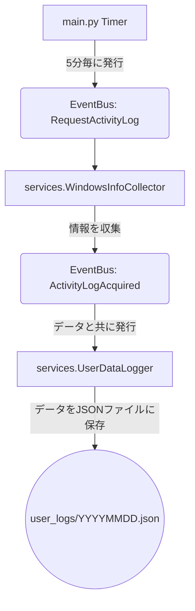
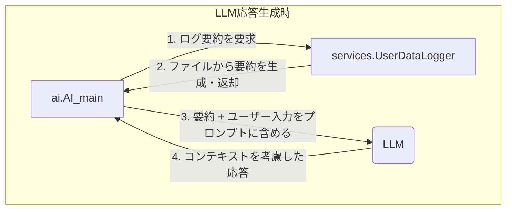

# ユーザーデータ収集機能の設計方針

**作成日:** 2025年10月19日

---

## 1. 概要

ユーザーのPC利用状況（アクティブウィンドウ等）を定期的に記録し、そのデータをLLMの応答生成に活用するための設計方針を定める。
`EventBus` を中心としたイベント駆動アーキテクチャを採用し、各モジュールの疎結合と高いメンテナンス性を実現することを目的とする。

## 2. 基本設計思想

- **関心の分離:** 各モジュールは「情報収集」「情報記録」「情報活用」のように、単一の責務に特化する。
- **イベント駆動:** モジュール間の連携は、原則として`EventBus`を介したイベントの発行・購読によって行う。これにより、お互いの実装詳細を知ることなく連携が可能になる。

## 3. アーキテクチャとデータフロー

### 3.1. リアルタイムな情報収集・記録フロー



1.  **起点 (`main.py`):** 5分ごとに `'RequestActivityLog'` イベントを発行する。
2.  **収集 (`WindowsInfoCollector`):** `'RequestActivityLog'` を購読。PC情報を収集し、`'ActivityLogAcquired'` イベントをデータと共に発行する。
3.  **記録 (`UserDataLogger`):** `'ActivityLogAcquired'` を購読。受け取ったデータをJSONファイルに永続化する。

### 3.2. LLM応答生成時の情報活用フロー



-   LLMでの応答生成が必要になった際、`AI_main`は`UserDataLogger`のインスタンスが持つメソッド（例: `get_summary()`）を直接呼び出し、RAGのためのコンテキスト情報を取得する。
-   このフローはリアルタイムのイベントチェーンからは独立しており、必要な時にのみ実行される。

## 4. 各モジュールの責務

| モジュール | 責務 | 説明 |
| :--- | :--- | :--- |
| `main.py` | **イベントの起点** | 5分タイマーを管理し、定期的に `'RequestActivityLog'` イベントを発行する。 |
| `services.WindowsInfoCollector` | **情報の収集と発行** | PCのアクティビティ（ウィンドウタイトル等）を収集する専門家。収集したデータを`'ActivityLogAcquired'`イベントで発行する。 |
| `services.UserDataLogger` | **情報の記録と提供** | あらゆる種類のデータを永続化（ファイル保存）する専門家。また、`AI_main`からの要求に応じて、記録済みデータから要約などを提供する。 |
| `ai.AI_main` | **情報の活用** | LLMとの対話を制御する専門家。応答生成時に`UserDataLogger`から情報を取得し、プロンプトのコンテキストとして活用する。 |

## 5. データ書き込み処理の仕様

`UserDataLogger`が将来的に様々な種類のデータ（アクティビティログ、会話ログ等）を扱うことを想定し、データ書き込みメソッドには**書き込み先の種類を指定するフラグ**を引数として設ける。

-   **メソッド定義（イメージ）:**
    ```python
    def add_log(self, data: dict, destination_flag: str):
        # ...
    ```
-   **`destination_flag` の役割:**
    このフラグの値に応じて、`UserDataLogger`は書き込み先のファイルや、JSON内のキーを切り替える。
    -   `'activity'`: ユーザーのアクティビティログ (`logs`キー配下)
    -   `'hourly_summary'`: 時間ごとの要約 (`hourlogs`キー配下)
    -   `'daily_summary'`: 1日の要約 (`daylogs`キー配下)
    -   `'conversation'`: (将来的な拡張) 対話ログ

これにより、`UserDataLogger`は汎用的なデータ記録モジュールとしての役割を担うことができる。

## 6. イベント一覧

| イベント名 | 発行者 | 購読者 | データ | 説明 |
| :--- | :--- | :--- | :--- | :--- |
| `RequestActivityLog` | `main.py` | `WindowsInfoCollector` | なし | PCアクティビティの収集を要求する。 |
| `ActivityLogAcquired` | `WindowsInfoCollector` | `UserDataLogger` | `dict` | 収集されたアクティビティ情報。 |

---

## 7. 将来的な検討事項

本設計をより堅牢にするため、将来的に以下の点を考慮する。

| カテゴリ | 検討事項 | 具体例・方針案 |
| :--- | :--- | :--- |
| **エラーハンドリング** | 各コンポーネントの処理が失敗した場合の挙動。 | ・情報収集失敗時: 「取得失敗」という内容でログを記録する。<br>・ファイル書込失敗時: エラーログを出力し、処理は続行する。 |
| **設定の柔軟性** | ハードコーディングを避け、ユーザーが挙動を制御できるようにする。 | ・機能全体のON/OFFフラグ。<br>・ログ収集間隔（周期）。<br>・ログ保存先ディレクトリ。<br>これらを設定ファイル(`config.ini`等)で管理する。 |
| **パフォーマンス** | 大量データや高コスト処理への対策。 | ・**サマリー生成のタイミング:** LLMの呼び出しは高コストなため、1時間に1回（例: 59分時点）など、実行タイミングを明確に定義する。<br>・**ログ読込の最適化:** RAGの際、巨大なログファイルを全て読まず、直近のデータやサマリーのみを利用する。 |
| **データ構造の進化** | ログフォーマットの変更に備える。 | ・将来ログに項目を追加しても、古いログ読込時にエラーにならないよう、後方互換性（例: `data.get('key', default_value)`）を意識する。 |